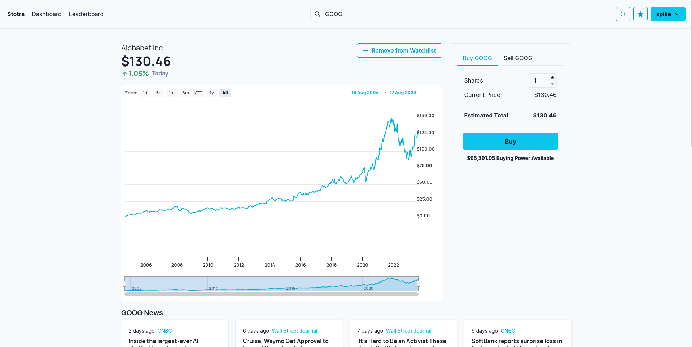
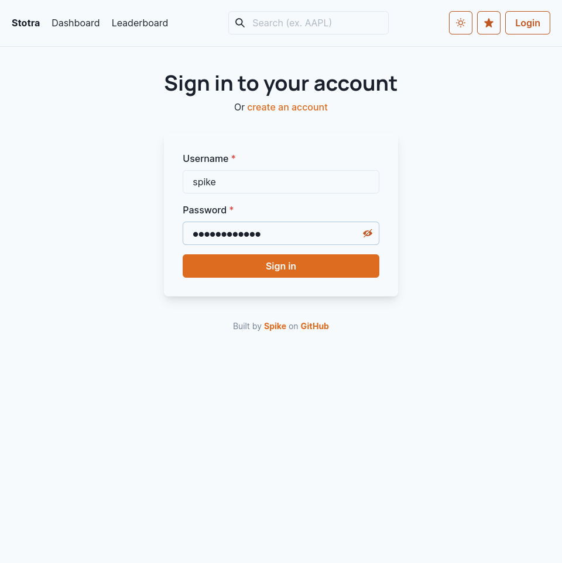
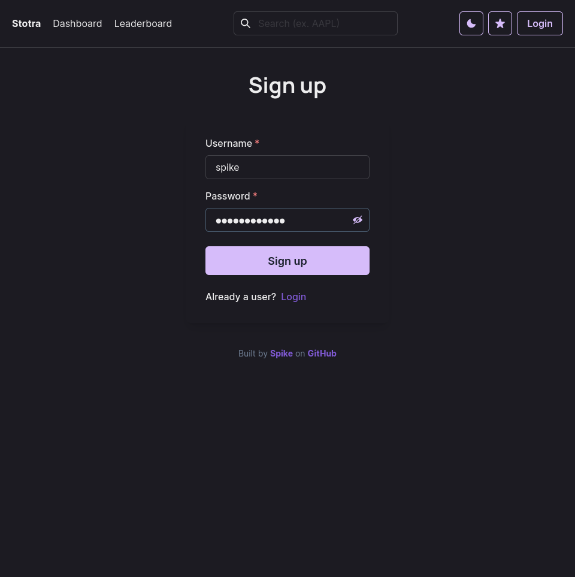
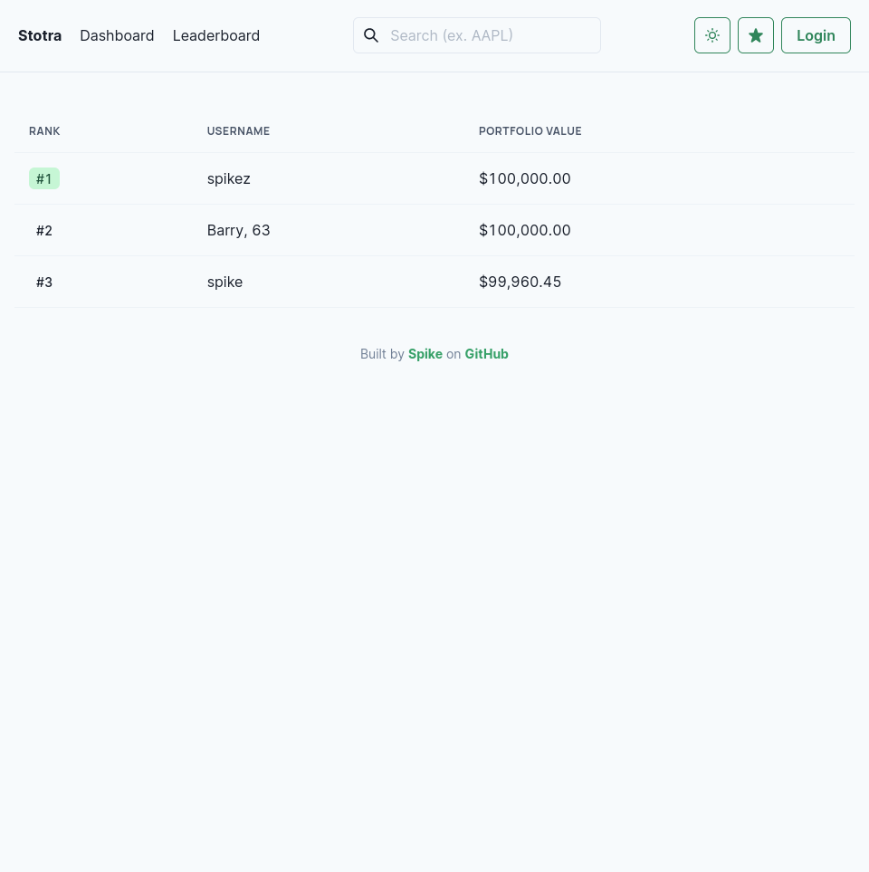
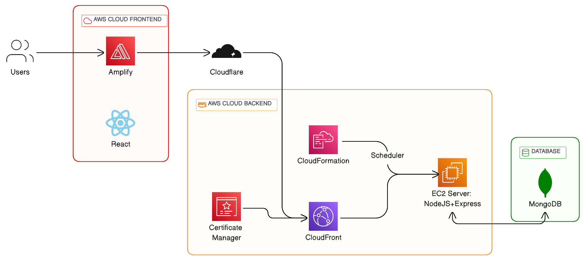

<div align="center">
  <a href="https://github.com/github_username/repo_name">
    
  </a>

<h1 align="center">Stotra</h3>

<p align="center">
    Multiplayer stock trading simulator built with React + MERN 📈
    <br />
    <a href="https://stotra.spike.codes"><strong>View the demo »</strong></a>
    <br />
    <br />
    <a href="https://stotra.spike.codes/api/docs/">Read API Docs</a>
    ·
    <a href="https://github.com/spikecodes/stotra/issues">Report Bug</a>
    ·
    <a href="https://github.com/spikecodes/stotra/issues">Request Feature</a>
  </p>
</div>

| Home                       | Stock View                        |
| -------------------------- | --------------------------------- |
|  |  |

| Login                        | Signup                          | Leaderboard                              |
| ---------------------------- | ------------------------------- | ---------------------------------------- |
|  |  |  |

Stotra is a multiplayer **STO**ck **TRA**ading simulator that allows users to engage in real-time virtual trading of stocks, currencies, and cryptocurrencies. With Stotra, users can practice trading without risking real money, making it an ideal platform for beginners to learn the ropes of trading. The project is powered by AWS, utilizing Amplify for the React frontend and Elastic Cloud Compute for the Express API.

I built Stotra in 70 hours split across 3 weeks of design, development, and deployment. I set development goals and stayed on top of them with Trello and tracked time spent on each portion with Toggl Track.

## Features ✨

- 🪙 Real-time virtual trading of stocks, currencies, and cryptocurrencies
- 🌐 Multiplayer leaderboard for competitive trading with friends
- 📊 Interactive charts and visualizations for better decision-making
- 🗞️ Access to financial news for informed trading
- 🎨 Beautiful design with dark mode and customizable accent color
- 📱 Responsive design for trading on-the-go

## Design 🖌️

The design was inspired by [Robinhood](https://robinhood.com/) and [this Dribbble shot](https://dribbble.com/shots/19488130-GoStock-Stock-Market-Dashboard). The frontend uses Chakra UI for a consistent and minimal design, with [Manrope](https://fonts.google.com/specimen/Manrope) for the headings and [Inter](https://rsms.me/inter/) for the body text.

The accent color defaults to Chakra's "Cyan 500" (`#00B5D8`), which can be changed in the app to any of [Chakra's sleek colors](https://chakra-ui.com/docs/styled-system/theme#colors). Using the toggle in the top right, one can switch between light and dark mode, as shown in the "Sign up" screenshot above.

## Security 🛡️

Stotra utilizes a robust and custom-built authentication system designed to ensure the security of user data and access to its services. Developed using TypeScript, the system incorporates features for user sign-up, login, and verification. To authenticate users, Stotra employs JSON Web Tokens (JWT), issuing a JWT to users upon successful login, which is then used for identity and permission verification in subsequent requests. As an added layer of security, Stotra integrates [Cloudflare Turnstile](https://www.cloudflare.com/products/turnstile/), a gatekeeping service that prevents unauthorized access to the platform.

### Known Limitations

- Users were authenticated with access tokens but not refresh tokens. Adding this additional check may verify users further and could allow storing the login in React's state. Currently, JWT tokens are stored in localStorage to allow access by React, something not possible with `httpOnly` Cookies. This is vulnerable to DOM-based XSS attacks just as state-stored tokens would be, albeit state-stored tokens are not as simple to access as localStorage ones.
- The system does not offer a password reset feature. This would most likely require an email sending service and for the sake of simplicity, I left it out in this project. For a production-level deployment, this is definitely something to add.
- Two-factor authentication is not included in the current security model. This is relatively minor for a stock trading _simulator_ but would be possible to implement with [otpauth](https://www.npmjs.com/package/otpauth).

## Architecture 🏗️

Stotra uses a microservices architecture, with separate services for the frontend and backend. The two services are stored in separate directories within this monorepo and are meant to be run simultaneously on different ports of the host. The frontend is built with React which interfaces with the Node.js/Express backend over a Restful API. The backend sends to and reads from the MongoDB database (run on MongoDB Atlas for the demo version). The project is hosted on AWS, with Amplify for the frontend and Elastic Cloud Compute for the backend.



## Get Started 🚀

### Prerequisites

- Node.js (v14.18+)
- MongoDB
  - I used [MongoDB Atlas](https://www.mongodb.com/basics/get-started) for the demo version
- Cloudflare Turnstile (for authentication)
  - [Create a free account](https://www.cloudflare.com/products/turnstile/) to get an API key

### Installation

1. Clone the repo

```sh
$ git clone https://github.com/spikecodes/stotra.git
$ cd stotra
```

2. Install NPM packages for both the frontend and backend

```sh
$ cd app
$ npm install
$ cd ../server
$ npm install
```

3. Create a `.env` file in the `server` directory and add the following environment variables:

```py
STOTRA_MONGODB_USERNAME=<username>
STOTRA_MONGODB_PASSWORD=<pass>
STOTRA_MONGODB_CLUSTER=<example: cluster0.example.mongodb.net>
STOTRA_JWT_SECRET=<random string of characters>
STOTRA_TURNSTILE_SECRET=<api key for turnstile>
# Optional: (for real-time news and stock data)
STOTRA_NEWSFILTER_API=<api key for news descriptions>
STOTRA_ALPHAVANTAGE_API=<api key for real-time stock data>
```

4. Run the frontend and backend in separate terminals

```bash
$ cd app
$ npm run dev

> stotra-frontend@0.0.0 dev
> vite

  VITE v4.4.9  ready in 503 ms

  ➜  Local:   http://localhost:5173/
  ➜  Network: http://192.168.1.242:5173/
  ➜  press h to show help
```

```sh
$ cd server
$ npm run dev

> stotra-backend@0.0.0 dev
> ts-node-dev --respawn --pretty --transpile-only ./src/index.ts

[INFO] 17:21:04 ts-node-dev ver. 2.0.0 (using ts-node ver. 10.9.1, typescript ver. 5.1.6)
Example app listening at http://0.0.0.0:3010
Swagger-autogen:  Success ✔
Swagger docs available at http://0.0.0.0:3010/api/docs
Connected to Database
```

## Technologies Used 💻

- **Frontend:** React, TypeScript Chakra UI, Axios, Highcharts
- **Backend:** Node.js, Express, MongoDB, Mongoose, JWT

## Author

👤 **Spike**

- Website: [spike.codes](https://spike.codes)
- Twitter: [@spikecodes](https://twitter.com/spikecodes)
- Github: [@spikecodes](https://github.com/spikecodes)

## Show your support

Give a ⭐️ if this project helped you!

## 📝 License

Copyright © 2023 [Spike](https://github.com/spikecodes).

This project is [MIT License](https://github.com/spikecodes/stotra/blob/main/LICENSE) licensed.
